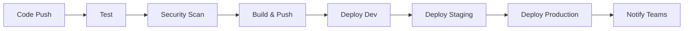

# Task Management API - Complete DevOps Project

[](https://github.com/your-org/task-management-api/actions)
[](https://codecov.io/gh/your-org/task-management-api)
[](LICENSE)

## 🎯 Project Overview

A comprehensive DevOps microservice project demonstrating enterprise-level practices for building, deploying, and monitoring a Task Management REST API. This project showcases the complete software delivery lifecycle from development to production using modern cloud-native technologies.

### 🏗️ Architecture

```
┌─────────────────┐     ┌─────────────────┐    ┌─────────────────┐
│   Frontend      │     │   API Gateway   │    │   Load Balancer │
│   (Optional)    │───▶│   (NGINX)       │───▶│   (K8s Service) │
└─────────────────┘     └─────────────────┘    └─────────────────┘
                                                        │
                       ┌─────────────────────────────────┼───────────────────────────────┐
                       │                                 ▼                               │
                       │        ┌─────────────────────────────────────────────────────┐  │
                       │        │           Task Management API                       │  │
                       │        │         (Spring Boot 3.2 + Java 17)                 │  │
                       │        └─────────────────────────────────────────────────────┘  │
                       │                                 │                               │
                       │                                 ▼                               │
                       │        ┌─────────────────────────────────────────────────────┐  │
                       │        │              MySQL Database                         │  │
                       │        │            (Persistent Storage)                     │  │
                       │        └─────────────────────────────────────────────────────┘  │
                       │                          Kubernetes Cluster                     │
                       └─────────────────────────────────────────────────────────────────┘

┌─────────────────┐    ┌─────────────────┐    ┌─────────────────┐    ┌─────────────────┐
│   Prometheus    │    │     Grafana     │    │   ELK Stack     │    │     ArgoCD      │
│   (Metrics)     │    │  (Dashboards)   │    │   (Logging)     │    │   (GitOps)      │
└─────────────────┘    └─────────────────┘    └─────────────────┘    └─────────────────┘
```

## 🚀 Quick Start

### Prerequisites
- Java 17+
- Docker & Docker Compose
- Kubernetes cluster (local or cloud)
- kubectl configured
- Helm 3.0+

### 🏃‍♂️ Run Locally (5 minutes)
```bash
# Clone repository
git clone https://github.com/your-org/task-management-api.git
cd task-management-api

# Start with Docker Compose
docker-compose up -d

# Verify deployment
curl http://localhost:8080/actuator/health
curl http://localhost:8080/api/tasks
```

### 🎛️ Deploy to Kubernetes (10 minutes)
```bash
# Setup environment
./scripts/setup-environment.sh

# Deploy application
./scripts/deploy-to-k8s.sh dev

# Access application
kubectl port-forward svc/task-api-service 8080:80 -n task-management
```

## 📋 API Endpoints

| Method | Endpoint | Description |
|--------|----------|-------------|
| GET | `/api/tasks` | Get all tasks |
| GET | `/api/tasks/{id}` | Get task by ID |
| POST | `/api/tasks` | Create new task |
| PUT | `/api/tasks/{id}` | Update task |
| DELETE | `/api/tasks/{id}` | Delete task |
| GET | `/actuator/health` | Health check |
| GET | `/actuator/prometheus` | Metrics |

### 🧪 API Usage Examples
```bash
# Create task
curl -X POST http://localhost:8080/api/tasks \
  -H "Content-Type: application/json" \
  -d '{"title":"Learn DevOps","description":"Complete project","status":"PENDING"}'

# Get all tasks
curl http://localhost:8080/api/tasks

# Update task
curl -X PUT http://localhost:8080/api/tasks/1 \
  -H "Content-Type: application/json" \
  -d '{"title":"Learn DevOps","description":"Complete project","status":"COMPLETED"}'
```

## 🛠️ Technology Stack

### Backend
- **Java 17** - Latest LTS with modern features
- **Spring Boot 3.2** - Enterprise application framework
- **Spring Data JPA** - Data persistence layer
- **MySQL 8.0** - Relational database
- **Maven** - Build and dependency management

### DevOps & Infrastructure
- **Docker** - Containerization platform
- **Kubernetes** - Container orchestration
- **Helm** - Kubernetes package manager
- **Terraform** - Infrastructure as Code
- **AWS EKS** - Managed Kubernetes service
- **Amazon ECR** - Container registry

### CI/CD & GitOps
- **GitHub Actions** - Continuous Integration
- **ArgoCD** - GitOps continuous deployment
- **Kustomize** - Kubernetes configuration management

### Monitoring & Observability
- **Prometheus** - Metrics collection
- **Grafana** - Visualization and dashboards
- **ELK Stack** - Centralized logging
- **Jaeger** - Distributed tracing

## 📁 Project Structure

```
task-management-api/
├── 1-project-overview/
│   └── README.md
├── 2-source-code/
│   ├── src/
│   │   ├── main/
│   │   │   ├── java/
│   │   │   │   └── com/
│   │   │   │       └── taskapi/
│   │   │   │           ├── TaskApiApplication.java
│   │   │   │           ├── controller/
│   │   │   │           │   └── TaskController.java
│   │   │   │           ├── model/
│   │   │   │           │   └── Task.java
│   │   │   │           ├── repository/
│   │   │   │           │   └── TaskRepository.java
│   │   │   │           ├── service/
│   │   │   │           │   └── TaskService.java
│   │   │   │           └── config/
│   │   │   │               └── DatabaseConfig.java
│   │   │   └── resources/
│   │   │       ├── application.yml
│   │   │       └── application-prod.yml
│   │   └── test/
│   │       └── java/
│   │           └── com/
│   │               └── taskapi/
│   │                   ├── TaskControllerTest.java
│   │                   └── TaskServiceTest.java
│   ├── pom.xml
│   ├── .gitignore
│   └── README.md
├── 3-cloudformation-setup/
│   ├── 01-vpc-stack.yaml
│   ├── 02-ec2-stack.yaml
│   ├── 03-eks-stack.yaml
│   └── README.md
├── 4-containerization/
│   ├── Dockerfile
│   ├── docker-compose.yml
│   ├── .dockerignore
│   └── README.md
├── 5-local-build-test/
│   ├── scripts/
│   │   ├── build.sh
│   │   ├── test.sh
│   │   └── run-local.sh
│   └── README.md
├── 6-kubernetes/
│   ├── namespace.yaml
│   ├── configmap.yaml
│   ├── secret.yaml
│   ├── mysql-deployment.yaml
│   ├── mysql-service.yaml
│   ├── task-api-deployment.yaml
│   ├── task-api-service.yaml
│   ├── ingress.yaml
│   ├── hpa.yaml
│   ├── pdb.yaml
│   └── README.md
├── 7-cicd/
│   ├── github-actions/
│   │   └── ci-cd-pipeline.yml
│   ├── jenkins/
│   │   └── Jenkinsfile
│   ├── argocd/
│   │   ├── application.yaml
│   │   └── config-repo/
│   │       ├── dev/
│   │       ├── staging/
│   │       └── production/
│   └── README.md
├── 8-monitoring/
│   ├── prometheus/
│   │   ├── prometheus-config.yaml
│   │   ├── prometheus-deployment.yaml
│   │   └── prometheus-service.yaml
│   ├── grafana/
│   │   ├── grafana-deployment.yaml
│   │   ├── grafana-service.yaml
│   │   └── dashboards/
│   ├── loki/
│   │   ├── loki-config.yaml
│   │   └── loki-deployment.yaml
│   ├── elk-stack/
│   │   ├── elasticsearch.yaml
│   │   ├── logstash.yaml
│   │   └── kibana.yaml
│   ├── load-testing/
│   │   ├── locust/
│   │   │   ├── locustfile.py
│   │   │   └── locust-deployment.yaml
│   │   └── k6/
│   │       └── load-test.js
│   └── README.md
├── 9-documentation/
│   ├── api-documentation.md
│   ├── deployment-guide.md
│   ├── troubleshooting.md
│   └── best-practices.md
├── .github/
│   └── workflows/
│       └── ci-cd.yml
├── scripts/
│   ├── setup-environment.sh
│   ├── deploy-to-k8s.sh
│   └── cleanup.sh
└── README.md
```

## 🔄 CI/CD Pipeline

### Pipeline Stages


### Branch Strategy
- **`develop`** → Development environment
- **`main`** → Staging → Production
- **Pull Requests** → Test & Security scans

### Deployment Environments
| Environment | Cluster | Namespace | Replicas | Auto-Deploy |
|-------------|---------|-----------|----------|-------------|
| Development | dev-cluster | task-management-dev | 1 | ✅ |
| Staging | staging-cluster | task-management-staging | 2 | ✅ |
| Production | prod-cluster | task-management | 3 | Manual Approval |

## 📊 Monitoring & Observability

### Metrics Dashboard
- **Request Rate**: API requests per second
- **Error Rate**: 4xx/5xx error percentage
- **Response Time**: P95 response latency
- **JVM Metrics**: Memory, CPU, garbage collection
- **Database**: Connection pool, query performance

### Logging
- **Centralized Logging**: ELK Stack aggregation
- **Structured Logs**: JSON format with correlation IDs
- **Log Levels**: Environment-specific configurations
- **Error Tracking**: Exception monitoring and alerting

### Alerting Rules
- High error rate (>5%)
- High response time (>2s)
- Application down
- High memory usage (>85%)
- Database connection issues

## 🔒 Security Features

### Application Security
- Input validation and sanitization
- SQL injection prevention
- Secure headers configuration
- Environment-based configurations

### Infrastructure Security
- Non-root container execution
- Network policies for pod communication
- Secret management with Kubernetes secrets
- RBAC for service accounts

### CI/CD Security
- OWASP dependency scanning
- Container image vulnerability scanning
- Secrets scanning in code
- Security reports in GitHub Security tab

## 🚀 Deployment Guide

### Local Development
```bash
# Using Docker Compose
docker-compose up -d

# Using Maven
mvn spring-boot:run
```

### Kubernetes Deployment
```bash
# Setup environment (one-time)
./scripts/setup-environment.sh

# Deploy to development
./scripts/deploy-to-k8s.sh dev

# Deploy to production
./scripts/deploy-to-k8s.sh prod
```

### AWS EKS Deployment
```bash
# Provision infrastructure
cd terraform/environments/prod
terraform init && terraform apply

# Deploy application
kubectl apply -f k8s/
```

## 📈 Performance & Scaling

### Auto-Scaling Configuration
- **HPA**: CPU (70%) and Memory (80%) based scaling
- **Min Replicas**: 2 (staging/prod)
- **Max Replicas**: 10
- **Scale Down**: Gradual with 5-minute stabilization

### Performance Optimizations
- **JVM Tuning**: Container-aware settings
- **Connection Pooling**: HikariCP optimization
- **Database Indexing**: Strategic index placement
- **Caching**: Application-level caching strategy

### Load Testing
```bash
# Using K6
k6 run monitoring/load-testing/k6/load-test.js

# Using Locust
kubectl apply -f monitoring/load-testing/locust/
```

## 🧪 Testing Strategy

### Test Pyramid
- **Unit Tests**: Service and repository layer testing
- **Integration Tests**: API endpoint testing with test containers
- **Contract Tests**: API contract validation
- **End-to-End Tests**: Full workflow testing
- **Performance Tests**: Load and stress testing

### Test Coverage
- **Target**: >80% code coverage
- **Tools**: JaCoCo for coverage reporting
- **CI Integration**: Coverage reports in pull requests

## 🔧 Development Workflow

### Local Development
```bash
# Setup development environment
./scripts/setup-local-dev.sh

# Run tests
mvn test

# Build application
mvn clean package

# Run locally
mvn spring-boot:run
```

### Contributing
1. Fork the repository
2. Create feature branch (`git checkout -b feature/amazing-feature`)
3. Commit changes (`git commit -m 'Add amazing feature'`)
4. Push to branch (`git push origin feature/amazing-feature`)
5. Open Pull Request

## 📚 Documentation

### Available Documentation
- [API Documentation](docs/api-documentation.md) - Complete API reference
- [Deployment Guide](docs/deployment-guide.md) - Step-by-step deployment
- [Troubleshooting](docs/troubleshooting.md) - Common issues and solutions
- [Best Practices](docs/best-practices.md) - Development and operational guidelines

### Architecture Decision Records
- [ADR-001: Technology Stack Selection](docs/adr/001-technology-stack.md)
- [ADR-002: Database Choice](docs/adr/002-database-choice.md)
- [ADR-003: Monitoring Strategy](docs/adr/003-monitoring-strategy.md)

## 🌐 Access URLs

### Development
- **API**: http://api-dev.taskmanagement.local
- **Grafana**: http://grafana-dev.taskmanagement.local
- **ArgoCD**: http://argocd-dev.taskmanagement.local

### Production
- **API**: https://api.taskmanagement.com
- **Grafana**: https://grafana.taskmanagement.com
- **ArgoCD**: https://argocd.taskmanagement.com

## 🤝 Team & Support

### Team
- **DevOps Engineer**: Infrastructure and deployment automation
- **Backend Developer**: API development and testing
- **SRE**: Monitoring, alerting, and reliability

### Support Channels
- **Issues**: GitHub Issues for bug reports
- **Discussions**: GitHub Discussions for questions
- **Slack**: #task-management-api for team communication
- **Email**: devops@taskmanagement.com for urgent issues

## 📊 Project Metrics

### Development Metrics
- **Build Success Rate**: >95%
- **Test Coverage**: >80%
- **Deployment Frequency**: Multiple times per day
- **Lead Time**: <2 hours from commit to production

### Operational Metrics
- **Uptime**: 99.9% SLA
- **Response Time**: <500ms P95
- **Error Rate**: <1%
- **MTTR**: <15 minutes

## 🎯 Roadmap

### Phase 1 (Current)
- ✅ Core API functionality
- ✅ CI/CD pipeline
- ✅ Kubernetes deployment
- ✅ Basic monitoring

### Phase 2 (Next Quarter)
- 🔄 Authentication & Authorization
- 🔄 Advanced monitoring & alerting
- 🔄 Multi-region deployment
- 🔄 Performance optimization

### Phase 3 (Future)
- 📋 Microservices architecture
- 📋 Event-driven architecture
- 📋 Advanced security features
- 📋 Machine learning integration

## 📄 License

This project is licensed under the MIT License - see the [LICENSE](LICENSE) file for details.

## 🙏 Acknowledgments

- Spring Boot team for the excellent framework
- Kubernetes community for container orchestration
- Prometheus & Grafana teams for monitoring tools
- AWS for cloud infrastructure services
- Open source community for various tools and libraries

---

## 🚀 Get Started Now!

```bash
# Quick start - get running in 5 minutes
git clone https://github.com/your-org/task-management-api.git
cd task-management-api
docker-compose up -d

# Test the API
curl http://localhost:8080/api/tasks
```

**Ready to deploy to production?** Follow our [Deployment Guide](docs/deployment-guide.md) for step-by-step instructions.

**Questions?** Check our [FAQ](docs/faq.md) or open an [issue](https://github.com/your-org/task-management-api/issues).

---

<div align="center">

**⭐ Star this repository if it helped you learn DevOps!**

[🐛 Report Bug](https://github.com/your-org/task-management-api/issues) • [✨ Request Feature](https://github.com/your-org/task-management-api/issues) • [💬 Discussions](https://github.com/your-org/task-management-api/discussions)

</div>
